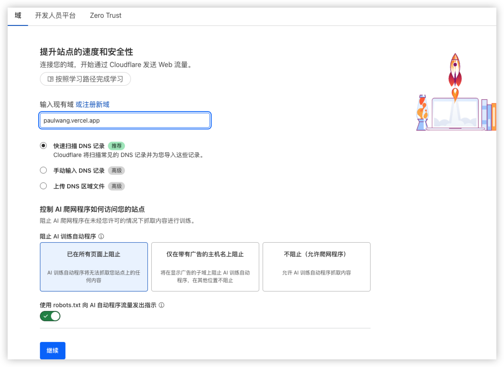

## 前言

国庆前的某天，在 b 站刷到了有关 `Astro` 框架的视频，于是内心有了一点念头。一方面是去了解一下前端相关的技术，另外是去重构一下我的 Blog 站点。在此之前，曾去了解了相当多的前端框架：Hexo/Hugo/React/Next. js/Gatsby 等，也算了对这个玩具的一个收尾吧。

## Dev

花了大概 3 天时间，借助 `AIGC`，结果十分出乎我的意料，完成了基于 Astro 框架的 Blog。有关 SSG 相关的框架架构上大体相同。分为如下几个部分

- Components
- Layout
- Style
- Pages
- Scripts
- ...

只需掌握基本的 `html/css/js` 基础，便可开始上手进行开发。利用 `Componetns` 去搭建 `Layout`，而不同的 `Pages` 又使用了不同的 `Layout`，最后借助 `Style` 进行样式调整，`Scripts` 进行动态内容添加与交互，便完成了一个最小的站点。

### Astro 特性

- [ ] 项目分析说明 📅 2025-10-17

...

## Deploy

Astro 对于 Vercel 的支持相当不错，开发完成之后，push 到 github，vercel 拉取相关的 repo 内容进行构建即可完成。

Demo 地址：https://paulwang.vercel.app/

### ~~CLOUDFLARE~~

使用 Free 版本即可添加基本保护与性能提升

## 优化

项目仍然存在不少可以优化的地方以及一些 feature 的增加

- [ ] Dark mode 📅 2025-10-24
- [ ] Encrypt article🔽 📅 2025-10-24
- [ ] 搜索
- [x] Cloudflare ✅ 2025-10-06
  - 由于使用了 Vercel 提供的域名，Cloudflare 无法使用
- [ ] RSS
