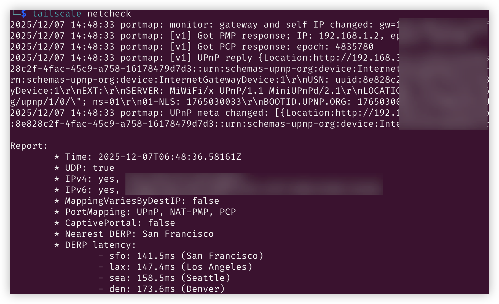
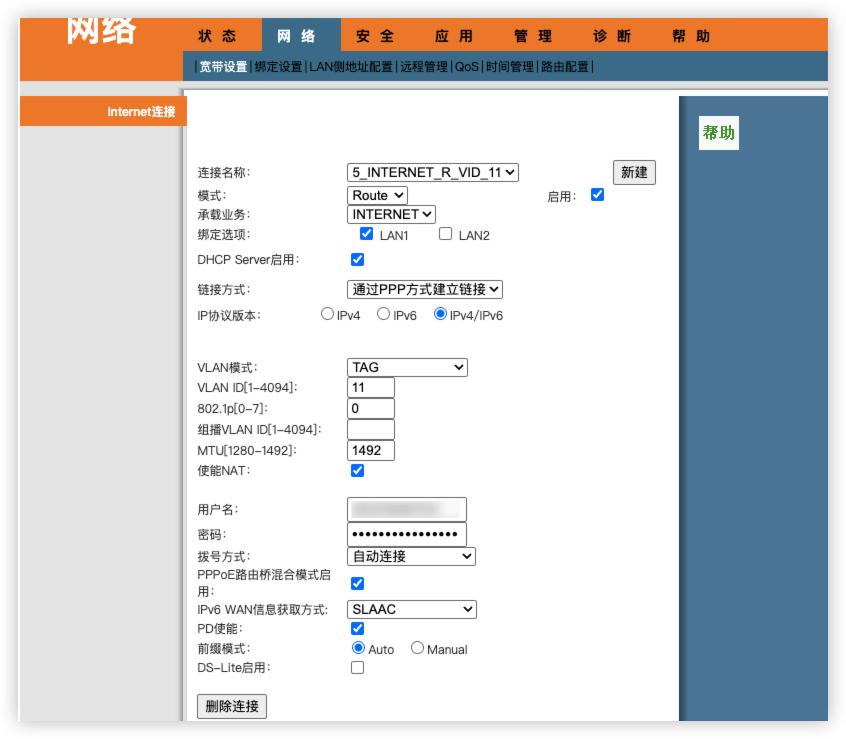
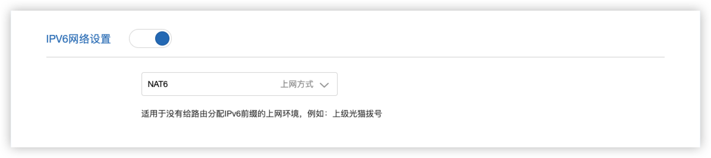
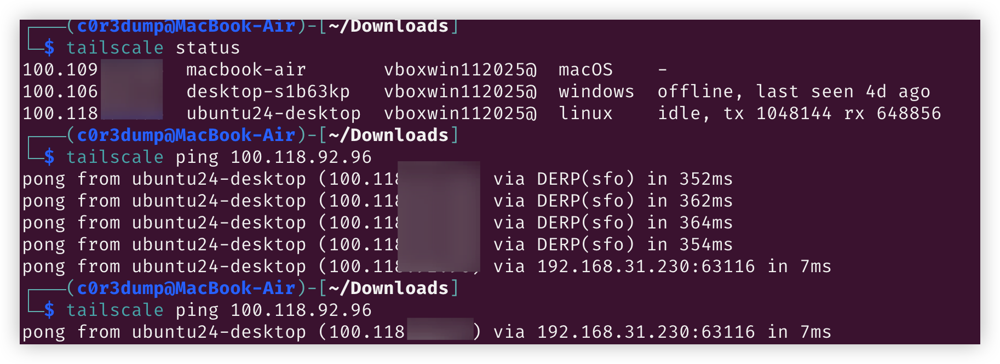
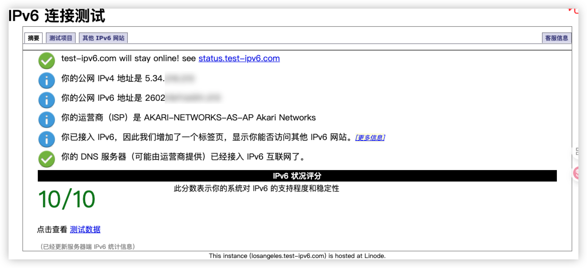

最近在尝试构建 Tailscale 的远程访问方案，多次打洞未成功，进行 `tailscale netcheck` 后，发现家中 `IPv6` 未能支持，于是尝试进行配置。


## 光猫

找到了不少信息

- 恩山无限论坛：https://www.right.com.cn/forum/thread-934706-1-1.html

配置文件与登录口令


```plaintext
# 普通用户登录光猫后，获取ROMFILE BACKUP文件，保存所有的账户信息
http://192.168.1.1/cgi-bin/upgrade.asp

```



## 小米路由器

在光猫后面，接了一个小米路由器，进入后台查看并配置 IPv6




Tailscale 开启后，进行 ping 测试。可以看的开始尝试使用 DERP 进行中继，后续则打洞成功，延迟有显著降低


IPv6 测试：https://test-ipv6.com/

