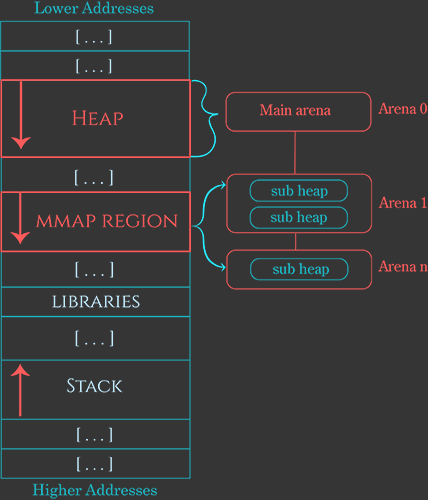
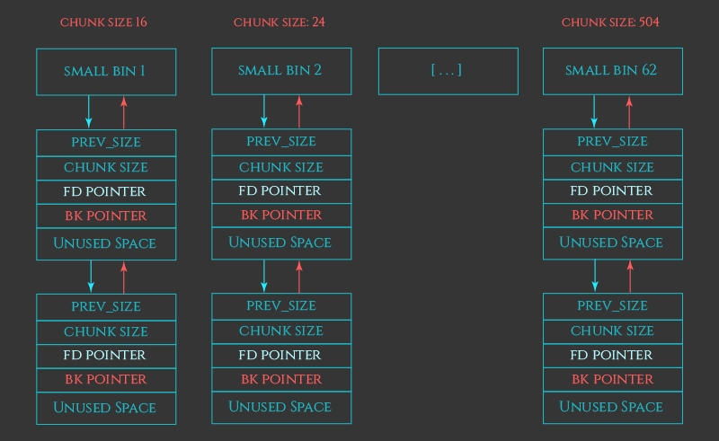
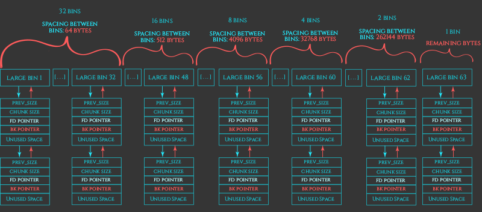
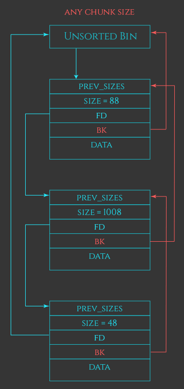
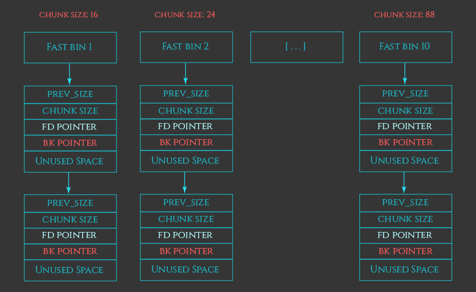

各操作系统实现对比

| **操作系统**  | **用户空间 (User malloc)**      | **核心特点**                               | **内核空间 (kmalloc 对应)** |
| ------------- | ------------------------------- | ------------------------------------------ | --------------------------- |
| **Linux**     | **ptmalloc** (glibc)            | 历史悠久，CTF 常见，多线程优化             | SLUB / SLAB                 |
| **Android**   | **Scudo** (v11+) / jemalloc     | Scudo 侧重安全；jemalloc 侧重并发          | SLUB / SLAB                 |
| **macOS/iOS** | **magazine_malloc** (libmalloc) | 基于 Zone (Nano/Tiny)，针对 Apple 硬件优化 | zalloc / kalloc             |
| **Windows**   | **Segment Heap** / NT Heap      | 封装于 HeapAlloc，结构极其复杂             | Paged/Non-Paged Pool        |
| **RTOS**      | **实现各异** (如 heap_4)        | 简单、确定性强、往往不支持碎片整理         | N/A (通常无内核/用户态隔离) |

主要分析 glibc 的内存管理机制 (ptmalloc2)

- 从单线程的 dlmalloc 到 ptmallloc 的并发时代

glibc 分配器的核心目标是<mark style="background: #FF5582A6;">通用性</mark>。它必须能够处理从只有几个字节的小型字符串分配，到数千兆字节的大型数组分配；从单线程的简单工具，到拥有数千个并发线程的高性能服务器。为了实现这一目标，`ptmalloc2`  采用了一种混合策略：

1. **分层缓存策略**：内存块不仅仅是简单的“已分配”或“空闲”，它们根据大小和最近的使用活跃度被放入不同的“桶”（Bins）中。从最快的 Tcache 到 Fast Bin，再到 Unsorted Bin, Small Bin 和 Large Bin，每一层都代表了不同的性能与碎片化权衡。

2. **延迟合并（Deferred Coalescing）**：为了提高速度，并非所有的释放操作都会立即触发内存合并。Tcache 和 Fast Bin 倾向于保持内存块的独立性以便快速重用，而 Small/Large bins 则倾向于合并以减少碎片。这种策略在 Unsorted Bin 的处理逻辑中体现得尤为明显。
3. **减少锁竞争**：在多线程环境下，全局锁是性能杀手。通过引入“Arena”（分配区）机制，以及随后的 Tcache (glibc 2.26)，glibc 试图将<mark style="background: #FF5582A6;">内存操作局部化</mark>，使得线程在绝大多数情况下无需争抢互斥锁即可完成分配。

通过引入多个独立的内存管理上下文，ptmalloc 将单一的全局堆锁拆分为细粒度的 per-Arena 锁，从而实现了并发性能的飞跃。然而，这种设计也带来了极其复杂的数据结构和状态管理逻辑。Glibc 2.26 版本进一步引入了 Tcache（Thread Local Cache）机制，这标志着从“<mark style="background: #FF5582A6;">基于锁的并发优化</mark>”向“无锁化线程本地缓存”的范式转移。

在线阅读源码：https://elixir.bootlin.com/glibc/glibc-2.26.9000/source/malloc/malloc.c

## 内存架构与 Arena 管理系统

在操作系统层面，内存分配器只是内核  `brk`  和  `mmap`  系统调用的高级封装。然而，在 glibc 内部，这是一个庞大而复杂的对象管理系统。理解 glibc 堆的第一步是理解其顶层管理结构——Arena。



### Arena

为了支持多线程的高效并发，glibc 实现了 Arena 机制。Arena 是一个独立的内存池，拥有自己的一套 Bins（空闲链表）、Top Chunk 和状态信息。

- Main Arena: 主线程初始化的第一个 Arena。代表了传统的，基于 `sbrk` 系统调用管理的堆空间。
- Thread Arena: 新线程产生且现有的 Arena 锁竞争激烈时，glibc 会动态创建新的 Arena。基于 `mmap` 系统调用管理内存。

> mmap 匿名映射：**匿名映射是一种不与任何文件关联的内存映射。它纯粹用于申请一块“干净”的物理内存页，并将其映射到进程的虚拟地址空间。**

系统通过一个<mark style="background: #FF5582A6;">全局的循环链表将所有 Arena 串联起来</mark>。当线程请求内存时，它会尝试锁定其绑定的 Arena；如果失败，它会遍历链表尝试锁定其他 Arena；如果所有 Arena 都繁忙，且未达到数量上限（`M_ARENA_MAX`），系统将创建一个新的 Thread Arena

#### Arena 数据结构

- `struct malloc_state`: 描述 Arena 的逻辑状态：bins、top chunk、锁等核心元数据
- `struct heap_info`: 描述 Thread Arena 的 Heap 信息。用于管理非连续的 `mmap` 内存区域

malloc_state

```c
struct malloc_state
{
  /* Serialize access.  */
  __libc_lock_define (, mutex);

  /* Flags (formerly in max_fast).  */
  // NON_CONTIGUOUS: Thread Arena
  int flags;

  /* Fast Bin */
  // Fast Bin数组
  mfastbinptr fastbinsY[NFASTBINS];

  /* Base of the topmost chunk -- not otherwise kept in a bin */
  // Top Chunk指针，指向Arena堆空间顶部的巨大空闲块
  mchunkptr top;

  /* The remainder from the most recent split of a small request */
  // 最近一次分割Small Chunk后剩余的部分，这是一种局部性优化，用于满足连续的小内存请求
  mchunkptr last_remainder;

  /* Normal bins packed as described above */
  // Unsorted Small Large Bins的存储位置
  mchunkptr bins[NBINS * 2 - 2];

  /* Bitmap of bins */
  // 快速查找非空Bin
  unsigned int binmap[BINMAPSIZE];

  /* Linked list */
  // 全局Arena链表指针
  struct malloc_state *next;

  /* Linked list for free arenas.  Access to this field is serialized
     by free_list_lock in arena.c.  */
     // 空闲Arena链表指针
  struct malloc_state *next_free;

  /* Number of threads attached to this arena.  0 if the arena is on
     the free list.  Access to this field is serialized by
     free_list_lock in arena.c.  */
     // 记录当前多少线程绑定到该Arena
  INTERNAL_SIZE_T attached_threads;

  /* Memory allocated from the system in this arena.  */
  // 系统内存总量
  INTERNAL_SIZE_T system_mem;
  // system_mem的历史峰值，用于统计和调优
  INTERNAL_SIZE_T max_system_mem;
};
```

heap_info

```c
/*
	A heap is a single contiguous memory region holding (coalesceable)
	malloc_chunks.  It is allocated with mmap() and always starts at an
	address aligned to HEAP_MAX_SIZE.
*/

typedef struct _heap_info
{
  // 指向当前Heap的`malloc_state`(Arena)，所以给定一个堆地址，可以得到堆管理地址
  mstate ar_ptr; /* Arena for this heap. */

  // Arena内的所有Heap信息
  struct _heap_info *prev; /* Previous heap. */
  size_t size;   /* Current size in bytes. */
  size_t mprotect_size; /* Size in bytes that has been mprotected
                           PROT_READ|PROT_WRITE.  */
  /* Make sure the following data is properly aligned, particularly
     that sizeof (heap_info) + 2 * SIZE_SZ is a multiple of
     MALLOC_ALIGNMENT. */
  char pad[-6 * SIZE_SZ & MALLOC_ALIGN_MASK];
} heap_info;
```

#### 内存扩展机制 ：sysmalloc

```c

/*
	sysmalloc handles malloc cases requiring more memory from the system.   On entry, it is assumed that 	av->top does not have enough   space to service request for nb bytes, thus requiring that av->top   	be extended or replaced.
*/
static void *sysmalloc (INTERNAL_SIZE_T, mstate);
```

Main Arena 扩容

- 调用  `sbrk`  增加 Program Break。
- 如果  `sbrk`  成功，直接增加  `main_arena. top`  的大小。
- 如果  `sbrk`  失败（返回  `MORECORE_FAILURE`），尝试使用  `mmap`  分配一块独立的内存，并将其作为“非连续”的堆块管理。这种情况下，Main Arena 也会包含非连续内存，但依然不使用  `heap_info` 。

Thread Arena 扩容

- 调用  `new_heap`  函数。
- `new_heap`  内部调用  `mmap`  申请一个新的、大小为  `HEAP_MAX_SIZE`（通常 64MB）的内存块。
- 在新块 header 初始化  `heap_info`，并将其链接到现有的 Heap 链表中。
- 更新 Arena 的 Top Chunk 指向新 Heap 的可用空间。

### Chunk

一段小范围的内存块，<mark style="background: #FF5582A6;">可以被 allocated (分配出去后由应用程序占有)，可以被 free (释放后由 glibc 占有)</mark>，或者与相邻的块合并成一个更大的块。每个块存在于 heap 中并且只属于一个 arena。


AMP 标记位 (size 字段后 3 位)

- A: 0: chunk 来自 Main Arena && Main Heap; 1: chunk 来自 Thread Arena。heap 地址可通过 chunk 地址进行计算
- M: 置 1 表示该 Chunk 通过 `mmap` 直接分配，`free ()` 时，不会将内存放入空闲链表，调用 `munmap ()` 将内存归还给操作系统；0：Chunk 属于 Heap，内存释放后留在 Heap 中，供下次 `malloc` 复用
- P (PREV_INUSE): 0：前一个 Chunk 空闲，1：前一个 Chunk 已被 Allocated。分配的第一个 Chunk 总是 1，防止内存越界。<mark style="background: #FF5582A6;">需要特别注意的是：某些 chunk，例如在 `fastbin` 里面的 chunk，尽管已经是 free 状态，但是该字段仍然被设置，其**真正的意义在于表明前面的 chunk 不应被考虑合并，起一个优化作用**。</mark>

chunk 数据结构

- https://elixir.bootlin.com/glibc/glibc-2.26.9000/source/malloc/malloc.c#L1057

```c
struct malloc_chunk;
typedef struct malloc_chunk* mchunkptr;

struct malloc_chunk {

  INTERNAL_SIZE_T      mchunk_prev_size;  /* Size of previous chunk (if free).  */

  // mchunk_size唯一始终有效的元数据字段。glibc严格内存对齐，8字节 or 16字节，故size必定是8或16的倍数。所以就可以利用空闲的低3位来做状态标志。
  INTERNAL_SIZE_T      mchunk_size;       /* Size in bytes, including overhead. */

  struct malloc_chunk* fd;         /* double links -- used only if free. */
  struct malloc_chunk* bk;

  /* Only used for large blocks: pointer to next larger size.  */
  // Large Bin的空闲Chunk使用
  struct malloc_chunk* fd_nextsize; /* double links -- used only if free. */
  struct malloc_chunk* bk_nextsize;
};
```

> Chunks of memory are maintained using a `boundary tag ` method as described in e.g., Knuth or Standish. (See the paper by Paul Wilson ftp://ftp.cs.utexas.edu/pub/garbage/allocsrv.ps for a survey of such techniques.) <mark style="background: #FF5582A6;">Sizes of free chunks</mark> are stored both in the front of each chunk and at the end. This makes consolidating fragmented chunks into bigger chunks very fast. The <mark style="background: #FF5582A6;">size fields</mark> also hold bits representing whether chunks are free or in use.

Allocated chunk

- `chunk` : 指向 chunk 头
- `mem`: 返回给用户的指针
- `nextchunk`: 下一个 chunk 的开始

```plaintext
	chunk-> +-+-+-+-+-+-+-+-+-+-+-+-+-+-+-+-+-+-+-+-+-+-+-+-+-+-+-+-+-+-+-+-+
	    	|             Size of previous chunk, if unallocated (P clear)  |
	    	+-+-+-+-+-+-+-+-+-+-+-+-+-+-+-+-+-+-+-+-+-+-+-+-+-+-+-+-+-+-+-+-+
	    	|             Size of chunk, in bytes                     |A|M|P|
  	  mem-> +-+-+-+-+-+-+-+-+-+-+-+-+-+-+-+-+-+-+-+-+-+-+-+-+-+-+-+-+-+-+-+-+
	    	|             User data starts here...                          .
	    	.                                                               .
	    	.             (malloc_usable_size() bytes)                      .
	    	.                                                               |
nextchunk-> +-+-+-+-+-+-+-+-+-+-+-+-+-+-+-+-+-+-+-+-+-+-+-+-+-+-+-+-+-+-+-+-+
	    	|             (size of chunk, but used for application data)    |
	    	+-+-+-+-+-+-+-+-+-+-+-+-+-+-+-+-+-+-+-+-+-+-+-+-+-+-+-+-+-+-+-+-+
	    	|             Size of next chunk, in bytes                |A|0|1|
	    	+-+-+-+-+-+-+-+-+-+-+-+-+-+-+-+-+-+-+-+-+-+-+-+-+-+-+-+-+-+-+-+-+
```

Free chunks

```plaintext
    Free chunks are stored in circular doubly-linked lists, and look like this:
    chunk-> +-+-+-+-+-+-+-+-+-+-+-+-+-+-+-+-+-+-+-+-+-+-+-+-+-+-+-+-+-+-+-+-+
	    	|             Size of previous chunk, if unallocated (P clear)  |
	    	+-+-+-+-+-+-+-+-+-+-+-+-+-+-+-+-+-+-+-+-+-+-+-+-+-+-+-+-+-+-+-+-+
	`head:' |             				Size of chunk, in bytes       |A|0|P|
	  mem-> +-+-+-+-+-+-+-+-+-+-+-+-+-+-+-+-+-+-+-+-+-+-+-+-+-+-+-+-+-+-+-+-+
	    	|             Forward pointer to next chunk in list             |
	    	+-+-+-+-+-+-+-+-+-+-+-+-+-+-+-+-+-+-+-+-+-+-+-+-+-+-+-+-+-+-+-+-+
	    	|             Back pointer to previous chunk in list            |
	    	+-+-+-+-+-+-+-+-+-+-+-+-+-+-+-+-+-+-+-+-+-+-+-+-+-+-+-+-+-+-+-+-+
	    	|             Unused space (may be 0 bytes long)                .
	    	.                                                               .
	    	.	                                                            |
nextchunk-> +-+-+-+-+-+-+-+-+-+-+-+-+-+-+-+-+-+-+-+-+-+-+-+-+-+-+-+-+-+-+-+-+
    `foot:' |             Size of chunk, in bytes                           |
	    	+-+-+-+-+-+-+-+-+-+-+-+-+-+-+-+-+-+-+-+-+-+-+-+-+-+-+-+-+-+-+-+-+
	    	|             Size of next chunk, in bytes                |A|0|0|
	    	+-+-+-+-+-+-+-+-+-+-+-+-+-+-+-+-+-+-+-+-+-+-+-+-+-+-+-+-+-+-+-+-+
```

#### Chunk size

heap_for_ptr (ptr)

基于对齐与掩码方式，从 `malloc_chunk` 定位 `heap_info`

- glibc 分配 Thread Heap 时，按照 `HEAP_MAX_SIXE` 进行对齐分配
- Heap 的起始地址是对齐的。`heap_info` 存放于 Heap 内存段的开头，那么，对于该 Heap 内的任何一个 Chunk 指针，低位地址屏蔽掉后，就可以得出 `heap_base`

```c
/* 假设 HEAP_MAX_SIZE 是 64MB (0x4000000) */
/* ~(HEAP_MAX_SIZE - 1) 会生成一个高位全1，低位全0的掩码 */
heap_base = chunk_ptr & ~(HEAP_MAX_SIZE - 1);
```

以下均为 64 位系统的分析

glibc 通过 `MALLOC_ALIGNMENT` 宏定义了全局内存对齐基准

```c
#define MALLOC_ALIGNMENT       (2 * SIZE_SZ < __alignof__ (long double) \
                               ? __alignof__ (long double) : 2 * SIZE_SZ)
    # SIZE_ZE: sizeof(size_t): 8 bytes
    # long double: 128bit 16bytes
    # MALLOC_ALIGNMENT = 16bytes

```

<mark style="background: #FF5582A6;">Chunk Overhead</mark>

- metadata: `size`: 8 bytes
- alignment: 64bit OS 下，16bytes 对齐，可能会有 Padding 的操作
- `MINSIZE`： 为了确保 Chunk 释放后，可以放入 Bin（存储 `fd` 与 `bk`）

request2size，将 req 转为实际需要分配的 Chunk 大小

```c
#define request2size(req)                                         \
  (((req) + SIZE_SZ + MALLOC_ALIGN_MASK < MINSIZE) ?             \
   MINSIZE :                                                      \
   ((req) + SIZE_SZ + MALLOC_ALIGN_MASK) & ~MALLOC_ALIGN_MASK)


# MINSIZE: chunk在free状态下的最小值: 0x20
	# prev_size: 8bytes
	# size: 8bytes
	# fd: 8bytes
	# bk: 8bytes
```

### Bins 管理系统

参考阅读

- https://azeria-labs.com/heap-exploitation-part-2-glibc-heap-free-bins/

> To improve performance, the heap manager instead maintains a series of lists called “bins”, which are designed to <mark style="background: #FF5582A6;">maximize speed of allocations and frees.</mark>

在 Tcache 出现之前，glibc 使用四种类型的 Bins 来管理<mark style="background: #FF5582A6;">空闲 Chunk</mark>：Fast Bin、Unsorted Bin、Small Bins 和 Large Bins。它们存储在  `malloc_state`  结构体的数组中。


[Bins](https://sourceware.org/git/gitweb.cgi?p=glibc.git; a=blob; f=malloc/malloc. c; h=6e766d11bc85b6480fa5c9f2a76559f8acf9deb5; hb=HEAD) 总览（每个 Arena）

- 62 smallbins
- 63 largebins
- 1 unsortedbin
- 10 fastbins
- 64 tcachebins

> The <mark style="background: #FF5582A6;">small</mark>, <mark style="background: #FF5582A6;">large</mark>, and <mark style="background: #FF5582A6;">unsorted</mark> bins are the oldest type of bin and are used to implement what I’ll refer to here as the *basic* recycling strategy of the heap. The <mark style="background: #FF5582A6;">fastbins</mark> and <mark style="background: #FF5582A6;">tcachebins</mark> are optimizations that layer on top of these.

这里只关注 `malloc_state` 中，有关 fastbins 与 bins 数组的部分

```c
struct malloc_state
{
  // ...

  /* Fast Bin */

  // Fast Bin数组
  mfastbinptr fastbinsY[NFASTBINS];

  /* Base of the topmost chunk -- not otherwise kept in a bin */
  // Top Chunk指针，指向Arena堆空间顶部的巨大空闲块
  mchunkptr top;

  /* The remainder from the most recent split of a small request */
  // 最近一次分割Small Chunk后剩余的部分，这是一种局部性优化，用于满足连续的小内存请求
  mchunkptr last_remainder;

  /* Normal bins packed as described above */
  // Unsorted Small Large Bins的存储位置
  mchunkptr bins[NBINS * 2 - 2];

  /* Bitmap of bins */
  // 快速查找非空Bin
  unsigned int binmap[BINMAPSIZE];

  // ...
};
```

Bins array

- `BINS[0]`: N/A
- `BINS[1]`: Unsorted Bin
- `BINS[2] - BINS[63]`: Small Bin
- `BIN[64] - BINS[126]`: Large Bin

#### Small / Large / Unsorted bins

Small bins (适用于小内存分配，chunk_size < 512/1024)

- 总共有 62 个 bin
- 每个 bin 中，chunk 的大小相同
- bin 之间相差 8/16 个 bytes
- 如下是 32-bit system 下的 Small Bins 数组，chunk size < 512

可以得出 chunk size 与 index 的关系：`chunk_size = 2 * SIZE_SZ * index`

64-bit system smallbins: `[32bytes, 48bytes, 64bytes, ..., 496bytes]`



Large bins (大内存分配，chunk_size > 512/1024)

> Large Bin 的设计假设是：内存块越大，用户对其精确大小的敏感度越低，因此可以将其归类到一个范围内。Glibc 将 63 个 Large Bin 分为 6 组，步长（Stride）随组别指数增长。

- 总共有 63 个 bin
- chunk_size 不固定，处于一定范围内（例如 512-576bytes）
- 使用 double list，进行降序排列
- 分配策略：Best-Fit



以 64-bit system 为例

- Group 1 (32 bins): stride 为 64（2^6） 字节
    - `Bin[64]: [1024, 1088)`
    - `Bin[65]: [1088, 1152)`
    - ...
- Group 2 (16 bins): stride 为 512 (2^9) 字节
- Group 3 (8 bins): stride 为 4096 (2^12) 字节
- Group 4 (4 bins): stride 为 32768 (2^15) 字节 (32KB)
- Group 5 (2 bins): stride 为 256KB
- Group 6 (1 bins): 剩余所有更大的 Chunk

<mark style="background: #FF5582A6;">Unsorted bins (Cache Layer)</mark>

| **数据结构** | **双向循环链表**。使用 Chunk 的  `fd`  和  `bk`  指针链接。                                |
| ------------ | ------------------------------------------------------------------------------------------ |
| **大小限制** | **无限制**。可以包含任何大小的 Chunk（只要不是 Fast Bin 大小，或者 Fast Bin 发生了合并）。 |
| **排序方式** | **无序**（Unsorted）。Chunk 按照释放的时间顺序插入，不按大小排序。                         |
| **插入策略** | 插入链表头部（Head）。                                                                     |
| **遍历策略** | 在  `malloc`  时从尾部（Tail, `bk`  方向）开始遍历整理。                                   |



Unsorted Bin 工作原理

Chunk 进入：主要有三种情况会把 Chunk 放入 Unsorted Bin：

1. **常规释放 (Free)**：

    - 当释放一个不属于 Fast Bin/Tcache 范围的 Chunk（例如大于 0x80 字节）时。
    - 或者释放一个属于 Fast Bin 范围，但因邻接 Chunk 空闲而触发了合并（Coalesce）后的新大块 Chunk。
    - 这些 Chunk 会被插入到 Unsorted Bin 的头部。

2. **Fast Bin 合并 (Consolidate)**：

    - 当  `malloc`  请求大内存引发  `malloc_consolidate`  时，Fast Bin 中的小 Chunk 会被取出并合并。
    - 合并后的结果会被放入 Unsorted Bin。

3. **切割剩余 (Remaindering)**：

    - 当  `malloc`  从一个大 Chunk（例如从 Large Bin 或 Top Chunk）中切割出一部分返回给用户时。
    - 剩余的部分（Remainder）如果足够大（> `MINSIZE`），会作为一个新的 Chunk 放入 Unsorted Bin。

流出
Unsorted Bin 的清理和分发主要发生在  `_int_malloc`  的核心循环中（通常被称为  **Big Loop**）。当 Tcache、Fast Bin 和 Smallbin（精确匹配）都无法满足请求时，分配器会遍历 Unsorted Bin：

1. **遍历方向**：从链表尾部（`bck = victim->bk`）开始向前遍历。
2. **精确匹配检查**：

    - 如果当前 Chunk 的大小  **==**  请求大小（`nb`）：
        - 直接将该 Chunk 从链表中摘除（Unlink）。
        - （如果开启 Tcache 且有空位）可能会利用这个机会填充 Tcache。
        - **直接返回给用户**，结束  `malloc`  过程。这是 Unsorted Bin 最大的性能收益点。

3. **整理（Binning）**：

    - 如果 Chunk 大小  **!=**  请求大小：
        - 将该 Chunk 从 Unsorted Bin 摘除。
        - 根据其大小，将其插入到对应的  **Small Bin**  或  **Large Bin**  中。这一步完成了 Chunk 从“无序缓存”到“有序仓库”的转移。

4. **循环控制**：

    - 为了防止 Unsorted Bin 过长导致卡顿，通常有一个遍历次数限制（如 10000 次）。
    - 如果遍历完整个链表都没找到合适的，或者达到了限制，分配器才会去查 Large Bin 或使用 Top Chunk。

#### Fast Bins - Cache Layer

```c
/* The maximum fastbin request size we support */
#define MAX_FAST_SIZE     (80 * SIZE_SZ / 4)
	# 64bit: MAX_FAST_SIZE = 160

#define NFASTBINS  (fastbin_index (request2size (MAX_FAST_SIZE)) + 1)


# 这里MAX_FAST_SIZE是永恒请求的大小，转为实际Chunk大小后，为：160 +

```

Fast Bin 是 glibc 堆管理器（ptmalloc）中针对**小内存块（Small Chunks）的一种特化缓存机制。其核心设计目标是极速**。<mark style="background: #FF5582A6;">fastbin 中的 chunk 会在需要的时候移动到其他的 bins 里面</mark>

- **不合并（No Coalescing）**：这是 Fast Bin 最本质的特征。当一个 Fast Bin 范围内的 Chunk 被释放（`free`）时，分配器**不会**尝试将其与相邻的空闲 Chunk 合并，也**不会**清除下一个物理相邻 Chunk 的 `PREV_INUSE` (P) 标志位。这使得 Chunk 保持“逻辑上被占用”的状态。目的：<mark style="background: #FF5582A6;">防止合并，便于快速复用</mark>
- **LIFO（后进先出）**：Fast Bin 被组织成单向链表，遵循 LIFO 原则。最近释放的 Chunk 会最先被再次分配。这极大地提高了 CPU 缓存（Cache）的命中率。



Fast Bin 与 Small Bin 的关系，可以类比为 **CPU L1 缓存** 与 **主内存** 的关系。它们管理的大小范围有重叠，但生命周期不同。

A. 大小范围的包含关系

Fast Bin 管理的 Chunk 大小完全落在 Small Bin 的管理范围内。

- **Fast Bin**: 32B, 48B, 64B... 128B (典型 64 位系统)
- **Small Bin**: 32B, 48B, 64B... 1024B
- **关系**：每一个 Fast Bin 的大小类别，都有一个对应的 Small Bin。例如，大小为 32 字节的 Chunk，既可以放在 `fastbinsY` 中，也可以放在 `smallbin[1]` 中。

B. 流动关系：单向晋升

Chunk 在这两个区域之间的流动是单向的，且遵循特定的生命周期：

1. **出生（Free）**：当一个小 Chunk 被释放时，为了速度，默认先放入 **Fast Bin (`fastbinsY`)**。

    - _此时 Chunk 并没有真正“归还”给堆，P 位保持为 1，无法合并。_

2. **暂存（Caching）**：如果此时发生 `malloc`，直接从 `fastbinsY` 拿走。这是最快路径。
3. **合并与晋升（Consolidation）**：如果 Fast Bin 中的 Chunk 长时间没用，或者触发了 **`malloc_consolidate`**（例如申请大内存、或 Top Chunk 空间不足），Fast Bin 中的 Chunk 会被强制回收。

    - 回收过程：取出 Fast Bin Chunk -> 清除 P 位 -> 与周围空闲块合并。
    - **结果**：合并后的 Chunk 会被放入 **Unsorted Bin**。

4. **归宿（Sorting）**：在随后的 `malloc` 循环中，如果 Unsorted Bin 中的块不匹配请求，它会被整理（Sort）并最终放入对应的 **Small Bin**。

**总结链条：** `free (ptr)` -> **Fast Bin (`fastbinsY`)** -> `malloc_consolidate` -> **Unsorted Bin** -> **Small Bin**

Fast Bin 中的 Chunk 就像是“暂留”状态，只有经过整理（Consolidate），才会变成“稳定”状态进入 Small Bin。

#### Tcache - Thread Cache Bins (Cache Layer)

Thread Local Cache, tcache 在 `glibc2.26` 时被引入。Ubuntu 17.10 之后引入


**Node 节点**

- malloc -> p
- `free (p)`: 直接复用 p 指针（User data），进行强制类型转换 `(tcache_entry *) p`

tcache_entry

```c
/* We overlay this structure on the user-data portion of a chunk when
   the chunk is stored in the per-thread cache.  */
typedef struct tcache_entry
{
  struct tcache_entry *next;
} tcache_entry;
```

单向链表

- Last in, First out

**The Manager**

- 每个线程私有的 Tcache 管理中枢
- 指向该结构体的指针，存放于 TLS（Thread Local Storage）中，无需加锁，速度很快

```c
/* There is one of these for each thread, which contains the
   per-thread cache (hence "tcache_perthread_struct").  Keeping
   overall size low is mildly important.  Note that COUNTS and ENTRIES
   are redundant (we could have just counted the linked list each
   time), this is for performance reasons.  */
typedef struct tcache_perthread_struct
{

  // counts数组，与entries数组进行对应。例如counts[i]: 记录了第i个链表里有多少个空闲块
  char counts[TCACHE_MAX_BINS];

  //
  tcache_entry *entries[TCACHE_MAX_BINS];
} tcache_perthread_struct;

// 最多64个bin
/* We want 64 entries.  This is an arbitrary limit, which tunables can reduce.  */
// From 32byts to 1040 bytes, Step: 16bytes
# define TCACHE_MAX_BINS        64
```

`counts` 数组（计数器）:

- 这是一个 `char` 类型的数组，与 `entries` 一一对应。
- 它记录了当前第 `i` 个链表里挂了多少个空闲块。
- **为什么要冗余存储？** 注释中提到 _"Note that COUNTS and ENTRIES are redundant... this is for performance reasons"_。虽然可以通过遍历链表来计算长度，但太慢了。Tcache 限制了每个 Bin 最多只能放 **7** 个块（默认）。有了 `counts`，glibc 可以在 O (1) 时间内判断：
    - 释放时：Bin 是不是满了（`counts[i] < 7`）？如果满了，就不能放 Tcache，得走传统路径（加锁放进 Fast Bin/Unsorted bin）。
    - 分配时：Bin 是不是空的（`counts[i] > 0`）？

默认情况下，tcache 中，每个 bin 中，最大 chunk：7

```c
#if USE_TCACHE
/* We want 64 entries.  This is an arbitrary limit, which tunables can reduce.  */
# define TCACHE_MAX_BINS		64
# define MAX_TCACHE_SIZE	tidx2usize (TCACHE_MAX_BINS-1)

/* Only used to pre-fill the tunables.  */
# define tidx2usize(idx)	(((size_t) idx) * MALLOC_ALIGNMENT + MINSIZE - SIZE_SZ)

/* When "x" is from chunksize().  */
# define csize2tidx(x) (((x) - MINSIZE + MALLOC_ALIGNMENT - 1) / MALLOC_ALIGNMENT)
/* When "x" is a user-provided size.  */
# define usize2tidx(x) csize2tidx (request2size (x))

/* With rounding and alignment, the bins are...
   idx 0   bytes 0..24 (64-bit) or 0..12 (32-bit)
   idx 1   bytes 25..40 or 13..20
   idx 2   bytes 41..56 or 21..28
   etc.  */

/* This is another arbitrary limit, which tunables can change.  Each
   tcache bin will hold at most this number of chunks.  */
# define TCACHE_FILL_COUNT 7
#endif

/* This is another arbitrary limit, which tunables can change.  Each
   tcachebin will hold at most this number of chunks.  */
# define TCACHE_FILL_COUNT 7

```

## Allocate and Free Algorithm

### Malloc

> -   **常态：** Main Arena = 1 个 sbrk Heap。
> -   **极端情况（内存碎片/耗尽）：** Main Arena = 1 个 sbrk Heap + N 个 mmap Heaps。

1. 首先通过 `request2size` 计算出实际的 chunk_size
2. 如果大小与 <mark style="background: #FF5582A6;">tcahce</mark> 的 bin 对应且存在 tcache chunk，立即返回
3. 如果请求巨大（M_MMAP_THRESHOLD = 128K），通过 `mmap` 在 heap 外进行分配
4. 否则，获取 Arena 的锁，并执行下面的策略
    1. Try fastbin/smallbin recycling strategy
        - 如果有对应的 <mark style="background: #FF5582A6;">fastbin</mark> 存在，尝试找到一个 chunk（伺机从 fastbin 填充 tcache）
        - 否则，如果有对应的 <mark style="background: #FF5582A6;">smallbin</mark> 存在，进行分配（伺机从 smallbin 填充 tcache）
    2. Resolve all the deferred frees（Fast Bin 延迟 free）
        - 遍历 fastbin，清除这些 chunk 的元信息，让这些块处于 free 状态
        - Consolidate: 合并，如果这些 chunk 的物理内存上是连续的，那么就会被合并，并且放入 <mark style="background: #FF5582A6;">unsorted bin</mark>。
    3. 遍历 unsorted bin, 如果有匹配的，那么进行分配；否则就将 unsorted bin 中的 chunk 移入到对应的 small/largebins 中。（伺机将部分 small chunk 填充至 tcache 中）
    4. 遍历 <mark style="background: #FF5582A6;">largebin</mark>，如果匹配，进行分配
    5. 创建一个新的 chunk
        - 尝试从 heap 的顶部获取一个 chunk，如果空间不够，先进行 `sbrk` 扩容
        - 如果无法扩容，那么 `mmap` 一个 `sub-heap` 区域
    6. If all else fail, return NULL

### Free

1. 如果 `free (pointer)`，如果指针为 NULL，那么不做任何操作
2. 否则，首先将 pointer 转为指向 chunk 的指针
3. 执行 sanity 检查，如果检查失败，那么中断操作
    1. 指针对齐
    2. Chunk size 是否合法
    3. double free 等基础错误
4. 如果 chunk size 与 tcache 匹配，那么放入 tcache
5. 如果 chunk 拥有 `M` 标志位，那么直接 `munmap` 释放
6. 否则，获取 Arena 锁，执行下面的策略
    1. 如果 chunk 与 fastbin 匹配，那么放入
    2. 如果 chunk_size > 64KB，对 fastbin 中的 chunk 进行合并，并放入 unsorted bin
    3. 对 chunk 与其相邻的物理 chunk 进行向前，向后合并
        1. 如果合并后的 chunk 紧邻 top chunk，那么直接并入 Top Chunk
        2. 否则放入 unsorted bin 中
7. Trim: 如果 Top Chunk 很大，超过收缩阈值 (trim_threshold)，调用 systrim

#### Source Code

```c
void
__libc_free (void *mem)
{
  mstate ar_ptr;
  mchunkptr p;                          /* chunk corresponding to mem */

  void (*hook) (void *, const void *)
    = atomic_forced_read (__free_hook);
  if (__builtin_expect (hook != NULL, 0))
    {
      (*hook)(mem, RETURN_ADDRESS (0));
      return;
    }

  // P = NULL
  if (mem == 0)                              /* free(0) has no effect */
    return;


  // mem pointer >> chunk pointer
  p = mem2chunk (mem);


  // munmap释放通过mmap的chunk，返回给操作系统
  if (chunk_is_mmapped (p))                       /* release mmapped memory. */
    {
      /* See if the dynamic brk/mmap threshold needs adjusting.
	 Dumped fake mmapped chunks do not affect the threshold.  */
      if (!mp_.no_dyn_threshold
          && chunksize_nomask (p) > mp_.mmap_threshold
          && chunksize_nomask (p) <= DEFAULT_MMAP_THRESHOLD_MAX
	  && !DUMPED_MAIN_ARENA_CHUNK (p))
        {
          mp_.mmap_threshold = chunksize (p);
          mp_.trim_threshold = 2 * mp_.mmap_threshold;
          LIBC_PROBE (memory_mallopt_free_dyn_thresholds, 2,
                      mp_.mmap_threshold, mp_.trim_threshold);
        }
      munmap_chunk (p);
      return;
    }

  MAYBE_INIT_TCACHE ();

  // 获取Arnea地址
  ar_ptr = arena_for_chunk (p);

  // free机制
  _int_free (ar_ptr, p, 0);
}

// ----------------
// ----------------

static void
_int_free (mstate av, mchunkptr p, int have_lock)
{
  INTERNAL_SIZE_T size;        /* its size */
  mfastbinptr *fb;             /* associated fastbin */
  mchunkptr nextchunk;         /* next contiguous chunk */
  INTERNAL_SIZE_T nextsize;    /* its size */
  int nextinuse;               /* true if nextchunk is used */
  INTERNAL_SIZE_T prevsize;    /* size of previous contiguous chunk */
  mchunkptr bck;               /* misc temp for linking */
  mchunkptr fwd;               /* misc temp for linking */

  const char *errstr = NULL;
  int locked = 0;

  size = chunksize (p);


  // Sanity Check
  /* Little security check which won't hurt performance: the
     allocator never wrapps around at the end of the address space.
     Therefore we can exclude some size values which might appear
     here by accident or by "design" from some intruder.  */
  if (__builtin_expect ((uintptr_t) p > (uintptr_t) -size, 0)
      || __builtin_expect (misaligned_chunk (p), 0))
    {
      errstr = "free(): invalid pointer";
    errout:
      if (!have_lock && locked)
        __libc_lock_unlock (av->mutex);
      malloc_printerr (check_action, errstr, chunk2mem (p), av);
      return;
    }
  /* We know that each chunk is at least MINSIZE bytes in size or a
     multiple of MALLOC_ALIGNMENT.  */
  if (__glibc_unlikely (size < MINSIZE || !aligned_OK (size)))
    {
      errstr = "free(): invalid size";
      goto errout;
    }


  // Double Free检查
  check_inuse_chunk(av, p);


#if USE_TCACHE
  {
    // 检查在tcache中，是否可以索引到size
    size_t tc_idx = csize2tidx (size);

    if (tcache
	&& tc_idx < mp_.tcache_bins
	&& tcache->counts[tc_idx] < mp_.tcache_count)
      {
	tcache_put (p, tc_idx);
	return;
      }
  }
#endif

  /*
    If eligible, place chunk on a fastbin so it can be found
    and used quickly in malloc.
  */

  if ((unsigned long)(size) <= (unsigned long)(get_max_fast ())

#if TRIM_FASTBINS
      /*
	If TRIM_FASTBINS set, don't place chunks
	bordering top into fastbins
      */
      && (chunk_at_offset(p, size) != av->top)
#endif
      ) {

    if (__builtin_expect (chunksize_nomask (chunk_at_offset (p, size))
			  <= 2 * SIZE_SZ, 0)
	|| __builtin_expect (chunksize (chunk_at_offset (p, size))
			     >= av->system_mem, 0))
      {
	/* We might not have a lock at this point and concurrent modifications
	   of system_mem might have let to a false positive.  Redo the test
	   after getting the lock.  */
	if (have_lock
	    || ({ assert (locked == 0);
		  __libc_lock_lock (av->mutex);
		  locked = 1;
		  chunksize_nomask (chunk_at_offset (p, size)) <= 2 * SIZE_SZ
		    || chunksize (chunk_at_offset (p, size)) >= av->system_mem;
	      }))
	  {
	    errstr = "free(): invalid next size (fast)";
	    goto errout;
	  }
	if (! have_lock)
	  {
	    __libc_lock_unlock (av->mutex);
	    locked = 0;
	  }
      }

    free_perturb (chunk2mem(p), size - 2 * SIZE_SZ);

    set_fastchunks(av);
    unsigned int idx = fastbin_index(size);
    fb = &fastbin (av, idx);

    /* Atomically link P to its fastbin: P->FD = *FB; *FB = P;  */
    mchunkptr old = *fb, old2;
    unsigned int old_idx = ~0u;
    do
      {
	/* Check that the top of the bin is not the record we are going to add
	   (i.e., double free).  */
	if (__builtin_expect (old == p, 0))
	  {
	    errstr = "double free or corruption (fasttop)";
	    goto errout;
	  }
	/* Check that size of fastbin chunk at the top is the same as
	   size of the chunk that we are adding.  We can dereference OLD
	   only if we have the lock, otherwise it might have already been
	   deallocated.  See use of OLD_IDX below for the actual check.  */
	if (have_lock && old != NULL)
	  old_idx = fastbin_index(chunksize(old));
	p->fd = old2 = old;
      }
    while ((old = catomic_compare_and_exchange_val_rel (fb, p, old2)) != old2);

    if (have_lock && old != NULL && __builtin_expect (old_idx != idx, 0))
      {
	errstr = "invalid fastbin entry (free)";
	goto errout;
      }
  }

  /*
    Consolidate other non-mmapped chunks as they arrive.
  */

  // 如果非小chunk，且无法进入Cache,进入标准的回收流程
  else if (!chunk_is_mmapped(p)) {
    // 加锁
    if (! have_lock) {
      __libc_lock_lock (av->mutex);
      locked = 1;
    }

    nextchunk = chunk_at_offset(p, size);

    /* Lightweight tests: check whether the block is already the
       top block.  */
    if (__glibc_unlikely (p == av->top))
      {
	errstr = "double free or corruption (top)";
	goto errout;
      }
    /* Or whether the next chunk is beyond the boundaries of the arena.  */
    if (__builtin_expect (contiguous (av)
			  && (char *) nextchunk
			  >= ((char *) av->top + chunksize(av->top)), 0))
      {
	errstr = "double free or corruption (out)";
	goto errout;
      }
    /* Or whether the block is actually not marked used.  */
    if (__glibc_unlikely (!prev_inuse(nextchunk)))
      {
	errstr = "double free or corruption (!prev)";
	goto errout;
      }

    nextsize = chunksize(nextchunk);
    if (__builtin_expect (chunksize_nomask (nextchunk) <= 2 * SIZE_SZ, 0)
	|| __builtin_expect (nextsize >= av->system_mem, 0))
      {
	errstr = "free(): invalid next size (normal)";
	goto errout;
      }

    free_perturb (chunk2mem(p), size - 2 * SIZE_SZ);

	// 向后合并
    /* consolidate backward */
    if (!prev_inuse(p)) {
      prevsize = prev_size (p);
      size += prevsize;
      p = chunk_at_offset(p, -((long) prevsize));
      unlink(av, p, bck, fwd);
    }

    if (nextchunk != av->top) {
      /* get and clear inuse bit */
      nextinuse = inuse_bit_at_offset(nextchunk, nextsize);

	  // 向前合并
      /* consolidate forward */
      if (!nextinuse) {
	unlink(av, nextchunk, bck, fwd);
	size += nextsize;
      } else
	clear_inuse_bit_at_offset(nextchunk, 0);


	// 放入 unsorted bin
      /*
	Place the chunk in unsorted chunk list. Chunks are
	not placed into regular bins until after they have
	been given one chance to be used in malloc.
      */

      bck = unsorted_chunks(av);
      fwd = bck->fd;
      if (__glibc_unlikely (fwd->bk != bck))
	{
	  errstr = "free(): corrupted unsorted chunks";
	  goto errout;
	}
      p->fd = fwd;
      p->bk = bck;
      if (!in_smallbin_range(size))
	{
	  p->fd_nextsize = NULL;
	  p->bk_nextsize = NULL;
	}
      bck->fd = p;
      fwd->bk = p;

      set_head(p, size | PREV_INUSE);
      set_foot(p, size);

      check_free_chunk(av, p);
    }


	// 如果合并后chunk与 top chunk相邻,吞入 Top Chunk
    /*
      If the chunk borders the current high end of memory,
      consolidate into top
    */

    else {
      size += nextsize;
      set_head(p, size | PREV_INUSE);
      av->top = p;
      check_chunk(av, p);
    }

    /*
      If freeing a large space, consolidate possibly-surrounding
      chunks. Then, if the total unused topmost memory exceeds trim
      threshold, ask malloc_trim to reduce top.

      Unless max_fast is 0, we don't know if there are fastbins
      bordering top, so we cannot tell for sure whether threshold
      has been reached unless fastbins are consolidated.  But we
      don't want to consolidate on each free.  As a compromise,
      consolidation is performed if FASTBIN_CONSOLIDATION_THRESHOLD
      is reached.
    */

    if ((unsigned long)(size) >= FASTBIN_CONSOLIDATION_THRESHOLD) {
      if (have_fastchunks(av))
	malloc_consolidate(av);

      if (av == &main_arena) {
#ifndef MORECORE_CANNOT_TRIM
	if ((unsigned long)(chunksize(av->top)) >=
	    (unsigned long)(mp_.trim_threshold))
	  systrim(mp_.top_pad, av);
#endif
      } else {
	/* Always try heap_trim(), even if the top chunk is not
	   large, because the corresponding heap might go away.  */
	heap_info *heap = heap_for_ptr(top(av));

	assert(heap->ar_ptr == av);
	heap_trim(heap, mp_.top_pad);
      }
    }

    if (! have_lock) {
      assert (locked);
      __libc_lock_unlock (av->mutex);
    }
  }
  /*
    If the chunk was allocated via mmap, release via munmap().
  */

  else {
    munmap_chunk (p);
  }
}


```

## 实验

单线程程序

```bash

# 内存映射
gef➤  vmmap
[ Legend:  Code | Stack | Heap ]
Start              End                Offset             Perm Path
0x0000aaaaaaaa0000 0x0000aaaaaaaa1000 0x0000000000000000 r-x /home/parallels/Works/tempdir/ptmallc_test
0x0000aaaaaaabf000 0x0000aaaaaaac0000 0x000000000000f000 r-- /home/parallels/Works/tempdir/ptmallc_test
0x0000aaaaaaac0000 0x0000aaaaaaac1000 0x0000000000010000 rw- /home/parallels/Works/tempdir/ptmallc_test
# heap addr
0x0000aaaaaaac1000 0x0000aaaaaaae2000 0x0000000000000000 rw- [heap]
0x0000fffff7de0000 0x0000fffff7f79000 0x0000000000000000 r-x /usr/lib/aarch64-linux-gnu/libc.so.6
0x0000fffff7f79000 0x0000fffff7f8d000 0x0000000000199000 --- /usr/lib/aarch64-linux-gnu/libc.so.6
0x0000fffff7f8d000 0x0000fffff7f90000 0x000000000019d000 r-- /usr/lib/aarch64-linux-gnu/libc.so.6
0x0000fffff7f90000 0x0000fffff7f92000 0x00000000001a0000 rw- /usr/lib/aarch64-linux-gnu/libc.so.6
0x0000fffff7f92000 0x0000fffff7f9e000 0x0000000000000000 rw-
0x0000fffff7fbe000 0x0000fffff7fe5000 0x0000000000000000 r-x /usr/lib/aarch64-linux-gnu/ld-linux-aarch64.so.1
0x0000fffff7ff7000 0x0000fffff7ff9000 0x0000000000000000 rw-
0x0000fffff7ff9000 0x0000fffff7ffb000 0x0000000000000000 r-- [vvar]
0x0000fffff7ffb000 0x0000fffff7ffc000 0x0000000000000000 r-x [vdso]
0x0000fffff7ffc000 0x0000fffff7ffe000 0x000000000002e000 r-- /usr/lib/aarch64-linux-gnu/ld-linux-aarch64.so.1
0x0000fffff7ffe000 0x0000fffff8000000 0x0000000000030000 rw- /usr/lib/aarch64-linux-gnu/ld-linux-aarch64.so.1
0x0000fffffffdf000 0x0001000000000000 0x0000000000000000 rw- [stack]

# Chunk
gef➤  heap chunks
Chunk(addr=0xaaaaaaac1010, size=0x290, flags=PREV_INUSE | IS_MMAPPED | NON_MAIN_ARENA)
    [0x0000aaaaaaac1010     00 00 00 00 00 00 00 00 00 00 00 00 00 00 00 00    ................]
Chunk(addr=0xaaaaaaac12a0, size=0x20, flags=PREV_INUSE | IS_MMAPPED | NON_MAIN_ARENA)
    [0x0000aaaaaaac12a0     00 00 00 00 00 00 00 00 00 00 00 00 00 00 00 00    ................]
Chunk(addr=0xaaaaaaac12c0, size=0x30, flags=PREV_INUSE | IS_MMAPPED | NON_MAIN_ARENA)
    [0x0000aaaaaaac12c0     00 00 00 00 00 00 00 00 00 00 00 00 00 00 00 00    ................]
Chunk(addr=0xaaaaaaac12f0, size=0x20d20, flags=PREV_INUSE | IS_MMAPPED | NON_MAIN_ARENA)  ←  top chunk


```

多线程程序

分析 Thread Arena

```c
// test.c

// #include <stdlib.h>


// int main() {

// void *p1 = malloc(0x10); // 分配一个小块

// void *p2 = malloc(0x20); // 再分配一块

// return 0;

// }


#include <stdio.h>

#include <stdlib.h>

#include <pthread.h>

#include <unistd.h>


void *thread_function(void *arg)

{

printf("[*] 子线程正在运行...\n");


// 在子线程中分配内存

// 这将触发创建一个新的 Arena (Non-Main Arena)

// 这个 Chunk 将位于一个 mmap 出来的 64MB 区域中

void *chunk = malloc(0x40);


printf("[*] 子线程 Chunk 地址: %p\n", chunk);

printf("[!] 现在用 GDB 中断下来查看吧! (正在休眠...)\n");


// 休眠足够长的时间供你调试

sleep(1000);


free(chunk);

return NULL;

}


int main()

{

pthread_t t1;


printf("[*] 主线程 PID: %d\n", getpid());


// 主线程也分配一点，确保 Main Arena 存在

malloc(0x10);


// 创建子线程

pthread_create(&t1, NULL, thread_function, NULL);


// 等待子线程结束

pthread_join(t1, NULL);


return 0;

}
```

```bash
gef➤  vmmap
[ Legend:  Code | Stack | Heap ]
Start              End                Offset             Perm Path
# Code/Data
0x0000aaaaaaaa0000 0x0000aaaaaaaa1000 0x0000000000000000 r-x /home/parallels/Works/tempdir/ptmallc_test
0x0000aaaaaaabf000 0x0000aaaaaaac0000 0x000000000000f000 r-- /home/parallels/Works/tempdir/ptmallc_test
0x0000aaaaaaac0000 0x0000aaaaaaac1000 0x0000000000010000 rw- /home/parallels/Works/tempdir/ptmallc_test

# Main Heap, 0x21000
0x0000aaaaaaac1000 0x0000aaaaaaae2000 0x0000000000000000 rw- [heap]

# Thread Arena
0x0000fffff0000000 0x0000fffff0021000 0x0000000000000000 rw-
0x0000fffff0021000 0x0000fffff4000000 0x0000000000000000 ---

# Thread Stack, Size: 0x4000000 = 64MB
0x0000fffff75d0000 0x0000fffff75e0000 0x0000000000000000 ---
0x0000fffff75e0000 0x0000fffff7de0000 0x0000000000000000 rw-

# Libc/Ld
0x0000fffff7de0000 0x0000fffff7f79000 0x0000000000000000 r-x /usr/lib/aarch64-linux-gnu/libc.so.6
0x0000fffff7f79000 0x0000fffff7f8d000 0x0000000000199000 --- /usr/lib/aarch64-linux-gnu/libc.so.6
0x0000fffff7f8d000 0x0000fffff7f90000 0x000000000019d000 r-- /usr/lib/aarch64-linux-gnu/libc.so.6
0x0000fffff7f90000 0x0000fffff7f92000 0x00000000001a0000 rw- /usr/lib/aarch64-linux-gnu/libc.so.6
0x0000fffff7f92000 0x0000fffff7f9e000 0x0000000000000000 rw-
0x0000fffff7fbe000 0x0000fffff7fe5000 0x0000000000000000 r-x /usr/lib/aarch64-linux-gnu/ld-linux-aarch64.so.1
0x0000fffff7ff7000 0x0000fffff7ff9000 0x0000000000000000 rw-
0x0000fffff7ff9000 0x0000fffff7ffb000 0x0000000000000000 r-- [vvar]
0x0000fffff7ffb000 0x0000fffff7ffc000 0x0000000000000000 r-x [vdso]
0x0000fffff7ffc000 0x0000fffff7ffe000 0x000000000002e000 r-- /usr/lib/aarch64-linux-gnu/ld-linux-aarch64.so.1
0x0000fffff7ffe000 0x0000fffff8000000 0x0000000000030000 rw- /usr/lib/aarch64-linux-gnu/ld-linux-aarch64.so.1

# Main Stack
0x0000fffffffdf000 0x0001000000000000 0x0000000000000000 rw- [stack]

# --------------------------------
# heap_info检查，如下使用一种 hack 的方式引入heap_info符号
gef➤  add-symbol-file ./fake_heap.o
gef➤  p *(struct heap_info*)0x0000fffff0000000
$1 = {
  ar_ptr = 0xfffff0000030,
  # 该Thread Arena第一个Heap
  prev = 0x0 <__force_symbol_generation>,
  size = 0x21000,
  mprotect_size = 0x21000,
  pad = "\000\020", '\000' <repeats 18 times>, "\002", '\000' <repeats 91 times>, "\260\v\000\360\377\377\000\000\000\000\000\000\000\000\000\000\220\000\000\360\377\377\000\000\220\000\000\360\377\377\000\000\240\000\000\360\377\377\000\000\240\000\000\360\377\377\000\000\260\000\000\360\377\377\000\000\260\000\000\360\377\377\000\000\300\000\000\360\377\377\000\000\300\000\000\360\377\377\000\000\320\000\000\360\377\377\000\000\320\000\000\360\377\377\000\000\340\000\000\360\377\377\000\000\340\000\000\360\377\377\000\000\360\000\000\360\377\377\000\000\360\000\000\360\377\377\000\000\000\001\000\360\377\377\000\000\000\001\000\360\377\377\000\000\020\001\000\360\377\377\000\000\020\001\000\360\377\377\000\000 \001\000\360\377\377\000\000 \001\000\360\377\377\000\0000\001\000\360\377\377\000\0000\001\000\360\377\377\000\000@\001\000\360\377\377\000\000@\001\000\360\377\377\000\000P\001\000\360\377\377\000\000P\001\000\360\377\377\000\000`\001\000\360\377\377\000\000`\001\000\360\377\377\000\000p\001\000\360\377\377\000\000p\001\000\360\377\377\000\000\200\001\000\360\377\377\000\000\200\001\000\360\377\377\000\000\220\001\000\360\377\377\000\000\220\001\000\360\377\377\000\000\240\001\000\360\377\377\000\000\240\001\000\360\377\377\000\000\260\001\000\360\377\377\000\000\260\001\000\360\377\377\000\000\300\001\000\360\377\377\000\000\300\001\000\360\377\377\000\000\320\001\000\360\377\377\000\000\320\001\000\360\377\377\000\000\340\001\000\360\377\377\000\000\340\001\000\360\377\377\000\000\360\001\000\360\377\377\000\000\360\001\000\360\377\377\000\000\000\002\000\360\377\377\000\000\000\002\000\360\377\377\000\000\020\002\000\360\377\377\000\000\020\002\000\360\377\377\000\000 \002\000\360\377\377\000\000 \002\000\360\377\377\000\0000\002\000\360\377\377\000\0000\002\000\360\377\377\000\000@\002\000\360\377\377\000\000@\002\000\360\377\377\000\000P\002\000\360\377\377\000\000P\002\000\360\377\377\000\000`\002\000\360\377\377\000\000`\002\000\360\377\377\000\000p\002\000\360\377\377\000\000p\002\000\360\377\377\000\000\200\002\000\360\377\377\000\000\200\002\000\360\377\377\000\000\220\002\000\360\377\377\000\000\220\002\000\360\377\377\000\000\240\002\000\360\377\377\000\000\240\002\000\360\377\377\000\000\260\002\000\360\377\377\000\000\260\002\000\360\377\377\000\000\300\002\000\360\377\377\000\000\300\002\000\360\377\377\000\000\320\002\000\360\377\377\000\000\320\002\000\360\377\377\000\000\340\002\000\360\377\377\000\000\340\002\000\360\377\377\000\000\360\002\000\360\377\377\000\000\360\002\000\360\377\377\000\000\000\003\000\360\377\377\000\000\000\003\000\360\377\377\000\000\020\003\000\360\377\377\000\000\020\003\000\360\377\377\000\000 \003\000\360\377\377\000\000 \003\000\360\377\377\000\0000\003\000\360\377\377\000\0000\003\000\360\377\377\000\000@\003\000\360\377\377\000\000@\003\000\360\377\377\000\000P\003\000\360\377\377\000\000P\003\000\360\377\377\000\000`\003\000\360\377\377\000\000`\003\000\360\377\377\000\000p\003\000\360\377\377\000\000p\003\000\360\377\377\000\000\200\003\000\360\377\377\000\000\200\003\000\360\377\377\000\000\220\003\000\360\377\377\000\000\220\003\000\360\377\377\000\000\240\003\000\360\377\377\000\000\240\003\000\360\377\377\000\000\260\003\000\360\377\377\000\000\260\003\000\360\377\377\000\000\300\003\000\360\377\377\000\000\300\003\000\360\377\377\000\000\320\003\000\360\377\377\000\000\320\003\000\360\377\377\000\000\340\003\000\360\377\377\000\000\340\003\000\360\377\377\000\000\360\003\000\360\377\377\000\000\360\003\000\360\377\377\000\000\000\004\000\360\377\377\000\000\000\004\000\360\377\377\000"
}


# Thread Arnea Chunks
gef➤  help heap chunks
Display all heap chunks for the current arena. As an optional argument
the base address of a different arena can be passed
Syntax: heap chunks [-h] [--all] [--allow-unaligned] [--summary] [--min-size MIN_SIZE] [--max-size MAX_SIZE] [--count COUNT] [--resolve] [arena_address]

gef➤  heap chunks 0x0000fffff0000030
Chunk(addr=0xfffff00008e0, size=0x290, flags=PREV_INUSE | IS_MMAPPED | NON_MAIN_ARENA)
    [0x0000fffff00008e0     00 00 00 00 00 00 00 00 00 00 00 00 00 00 00 00    ................]
Chunk(addr=0xfffff0000b70, size=0x50, flags=PREV_INUSE | IS_MMAPPED | NON_MAIN_ARENA)
    [0x0000fffff0000b70     00 00 00 00 00 00 00 00 00 00 00 00 00 00 00 00    ................]
Chunk(addr=0xfffff0000bc0, size=0x20450, flags=PREV_INUSE | IS_MMAPPED | NON_MAIN_ARENA)  ←  top chunk

```

分析 Chunk size

```bash
gef➤  heap chunks
Chunk(addr=0xaaaaaaac1010, size=0x290, flags=PREV_INUSE | IS_MMAPPED | NON_MAIN_ARENA)
    [0x0000aaaaaaac1010     00 00 00 00 00 00 00 00 00 00 00 00 00 00 00 00    ................]
Chunk(addr=0xaaaaaaac12a0, size=0x410, flags=PREV_INUSE | IS_MMAPPED | NON_MAIN_ARENA)
    [0x0000aaaaaaac12a0     5b 2a 5d 20 e5 88 86 e9 85 8d e7 9a 84 20 43 68    [*] ......... Ch]
Chunk(addr=0xaaaaaaac16b0, size=0x110, flags=PREV_INUSE | IS_MMAPPED | NON_MAIN_ARENA)
    [0x0000aaaaaaac16b0     00 00 00 00 00 00 00 00 00 00 00 00 00 00 00 00    ................]
Chunk(addr=0xaaaaaaac17c0, size=0x20850, flags=PREV_INUSE | IS_MMAPPED | NON_MAIN_ARENA)  ←  top chunk

# 程序中，申请的内存大小为0x100，结合之前提到的overhead，实际的chunk地址为: 0x0000aaaaaaac16b0 - 0x10 = 0x0000aaaaaaac16a0
gef➤  x/8gx 0xaaaaaaac16a0
0xaaaaaaac16a0: 0x0000000000000000      0x0000000000000111
0xaaaaaaac16b0: 0x0000000000000000      0x0000000000000000
0xaaaaaaac16c0: 0x0000000000000000      0x0000000000000000
0xaaaaaaac16d0: 0x0000000000000000      0x0000000000000000
gef➤  p *(struct malloc_chunk *)(0xaaaaaaac16a0)
$3 = {
  prev_size = 0x0,
  size = 0x111,
  fd = 0x0 <__force_chunk>,
  bk = 0x0 <__force_chunk>,
  fd_nextsize = 0x0 <__force_chunk>,
  bk_nextsize = 0x0 <__force_chunk>
}

# 此时根据0x111的二进制展开：'0b100010001' & |A|M|P|，可更好的理解
	# A: 0, Main Arena
	# M: 0, 非`mmap`单独分配
	# P: 1, Prev in-use

# 同时也可以看到，下一个Chunk的地址，即: 0x0000aaaaaaac16a0 + 0x110 = 0x0000aaaaaaac17b0

```

### 调试 glibc

> 之所以你遇到 `No struct type named heap_info` 报错，**并不是因为 glibc 版本去掉了它，而是因为你缺少了调试符号（Debug Symbols）**。`heap_info` 是 glibc 内部私有的结构体，普通编译的 libc 库不包含它的类型定义。

```bash
# 当前glibc版本
❯ ldd --version
ldd (Ubuntu GLIBC 2.39-0ubuntu8.6) 2.39
Copyright (C) 2024 Free Software Foundation, Inc.
This is free software; see the source for copying conditions.  There is NO
warranty; not even for MERCHANTABILITY or FITNESS FOR A PARTICULAR PURPOSE.
Written by Roland McGrath and Ulrich Drepper.

# 检查gdb信息
❯ gdb --version
GNU gdb (Ubuntu 15.0.50.20240403-0ubuntu1) 15.0.50.20240403-git
Copyright (C) 2024 Free Software Foundation, Inc.
License GPLv3+: GNU GPL version 3 or later <http://gnu.org/licenses/gpl.html>
This is free software: you are free to change and redistribute it.
There is NO WARRANTY, to the extent permitted by law.
❯ gdb --configuration | grep debugin
             --with-debuginfod


# 下载源码并解压
1645  sudo apt install glibc-source
1646  ls /usr/src/glibc
1647  sudo tar xvf /usr/src/glibc/glibc-2.39.tar.xz -C ./

sudo apt install libc6-dbg
gef➤ set debuginfod urls "https://debuginfod.elfutils.org/"
gef➤ set debuginfod enabled on
gef➤  directory ./glibc-2.39/
```

很遗憾，我的 glibc 的 Build ID 在服务器上没有找到

```bash
gef➤  shell readelf -n /usr/lib/aarch64-linux-gnu/libc.so.6 |grep "Build ID"
    Build ID: d6c205bda1b6e91815f8fef45bdf56bc2239c37e
gef➤  q
❯ curl -I https://debuginfod.ubuntu.com/buildid/d6c205bda1b6e91815f8fef45bdf56bc2239c37e/debuginfo
HTTP/2 400
strict-transport-security: max-age=15768000
date: Sun, 23 Nov 2025 11:00:11 GMT
content-type: text/plain
content-length: 19
server: Apache/2.4.52 (Ubuntu)
```

针对本次实验，使用一种 hack 的方式，伪造符号

```c
// fake_heap.c
#include <stddef.h>

// 1. 定义 Arena 的指针结构 (GDB 需要知道它是个指针)
struct malloc_state {
    char _pad[8]; // 占位
};

// 2. 定义 heap_info 结构体
struct heap_info {
    struct malloc_state *ar_ptr; /* 0x00: 指向 Arena (这是你最想看的) */
    struct heap_info *prev;      /* 0x08: 前一个 Heap */
    size_t size;                 /* 0x10: 这一块 Heap 的总大小 */
    size_t mprotect_size;        /* 0x18: 保护大小 */
    char pad[1024];              /* 填充，防止数组越界 */
};

// 3. 强制生成符号
struct heap_info *__force_symbol_generation;
```

编译

```bash
❯ gcc -g -c fake_heap.c -o fake_heap.o
```

## 参考

https://azeria-labs.com/heap-exploitation-part-1-understanding-the-glibc-heap-implementation/

[堆相关数据结构 - CTF Wiki](https://ctf-wiki.org/pwn/linux/user-mode/heap/ptmalloc2/heap-structure/)

[https://elixir.bootlin.com/glibc/glibc-2.26.9000/source/malloc/malloc.c](https://elixir.bootlin.com/glibc/glibc-2.26.9000/source/malloc/malloc.c)

[https://xz.aliyun.com/t/10325](https://xz.aliyun.com/t/10325)

《Glibc 内存管理》华庭

[glibc malloc 学习笔记之 fastbin](https://paper.seebug.org/445/)

[https://sploitfun.wordpress.com/2015/02/10/understanding-glibc-malloc/](https://sploitfun.wordpress.com/2015/02/10/understanding-glibc-malloc/)

*Tcache in glibc* Angelboy
