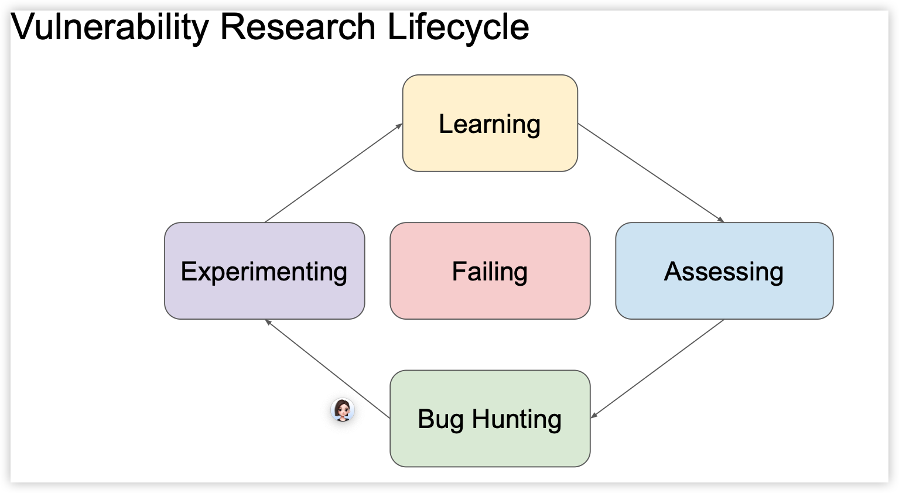

> 记录一些思维模式，或许我们能寻门而入

- [安全研究员的自我修养 - 有价值炮灰](https://evilpan.com/2020/12/27/my2020/)

Hack to learn, not learn to hack.

- [漫谈漏洞挖掘 - 有价值炮灰](https://evilpan.com/2021/05/22/bug-hunting/)

1. 找到公开的漏洞通告，根据标题的内容自己去相关模块中审计看是否能发现该漏洞
2. 如果发现不了，就回头接着看漏洞通告的细节，反思自己的审计方法
3. 不断重复，直到让自己可以认为找漏洞只是时间问题而不是能力问题

- [漫谈逆向工程 - 有价值炮灰](https://evilpan.com/2020/03/08/reverse-engineering/)

Stay Curious, Stay Exploring && Happy Hacking!

## Approaching Vulnerability Research

- [Leveling Up: How Hacking Consoles Launched My Cybersecurity Career](https://typhooncon.com/2025-conference-agenda/) - _Andy Nguyen_

1. 学习 (Learning)

• **基础知识：** 对系统中的所有 bug 类别建立信心，例如针对 C/C++ 的**整数溢出、缓冲区溢出、释放后重用 (UaF)、二次释放、类型混淆**等。理解这些 bug 的各种根源。

• **利用现有资源：** 查找关于先前或类似研究的**技术文章、学术论文和演讲**，并努力理解。

• **分析公开代码：** 分析公共的 PoC/漏洞利用程序，单元测试/回归测试中通常也包含 PoC。

• **系统理解：** 从事与该系统相关的非安全项目，以提升理解（可能会遇到其他开发者也遇到的陷阱）。找出系统的配置并理解代码是如何编译的。

2. 评估：映射攻击面 (Assessing: Mapping the Attack Surface)

• **识别交互点：** 枚举与系统交互的方式。

• **寻找切入点：** 找到处理**不可信用户数据**的入口点。

• **函数识别：** 识别具有有趣名称的函数，例如 `recv`、`send`、`copy`、`parse`、`cmd`、`deserialize` 等。

• **第三方组件：** 枚举所有使用的第三方项目，并查找自定义补丁或配置。

• **覆盖率：** 查找模糊测试工具（fuzzing harnesses），以指示关键 API 并识别低覆盖率区域（高覆盖率 ≠ 无 bug）。

• **“金矿”：** 尝试找到**先前未知的攻击面**，这被称为“金矿”。

3. 漏洞搜寻 (Bug Hunting)

• **低级错误：** 从**容易发现的低垂果实**开始，例如典型的编程错误。这包括像 `malloc(a * b)` 这样的整数溢出，或者路径遍历（通常影响很大且易于发现）。

• **工具使用：** 使用静态分析工具，例如 weggli，或者通过 `grep`/Ctrl+F 搜索感兴趣的函数。对于堆漏洞，检查所有 `malloc` 及其相关的函数；对于 BoFs/OOBs，检查所有 `memcpy` 和数组访问。

• **N 日漏洞和变体：** 在第三方组件中寻找 N 日漏洞（已公开但未修复的漏洞），或寻找先前错误的变体，因为开发者通常只修复报告给他们的特定 bug。

• **高级漏洞：** 最终目标是寻找**架构和逻辑漏洞**。

• **不一致性：** 找出某些操作的原因，以及如果它们缺失或执行不正确会发生什么。分析**安全检查**是如何以及为何进行的。检查是否存在**互斥锁**，如果存在，则意味着代码可以并发运行。寻找设计与实现之间的差异，以及**解析器差异**（当数据以不同方式解析时），这可能导致有趣的 bug。

◦ _示例：_ FreeBSD IPv6 Use-after-free (CVE-2020-7457) 示例展示了在**未加锁**的情况下被调用的代码。

◦ _示例：_ VirtualBox OOB write (CVE-2023-22098) 示例展示了断言中使用了**错误的比较**，导致 OOB 写入。

• **假设：** 警惕开发者做的假设（通常假设输入格式正确）。同时，要验证自己的假设。不要假设代码没有 bug，不要假设开发者考虑了所有边界情况，也不要假设 bug 会永远消失（因为**回归**可能会发生）。

4. 实验 (Experimenting)

• **实际运行：** 不要只盯着代码，要**编译并运行它**。使用**消毒剂 (sanitizers)** 编译代码。使用调试符号编译代码并附加调试器。

• **重现与改进：** 重现他人的发现，以提高自身的理解。开发漏洞利用程序以保持自己的积极性。

• **模糊测试：** 编写模糊测试器/模糊测试工具，尝试发现和触发已知 bug。

• **PoC：** 编写简单的 PoC 来到达有趣的**代码路径**，因为罕见的代码路径可能完全未经测试。

